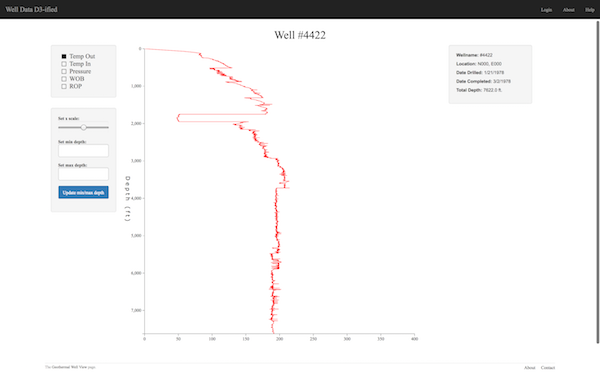
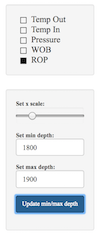
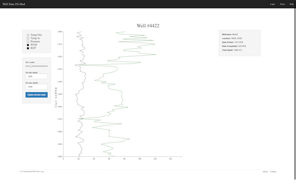

# Wellview

## Context
Thousands of geothermal wells have been drilled and are currently being drilled all over the world. Several data points are collected for each foot drilled during this process resulting in massive amounts of data stored in cumbersome text files. The resulting files can be thousands of lines long as some wells can reach up to 12,000 ft deep.
 
Wellview is an ongoing project that I created to tackle the cumbersome text file problem and to utilize the features of D3.js. D3.js is a JavaScript library for manipulating documents based on data. The app takes drilling data from geothermal wells in Northern California and displays it in a user friendly graphical format. It uses Ruby on Rails for the backend and JavaScript, specifically the D3.js library, for the front end.

*Note* -
Because this project is meant to be a vehicle to play with the features of D3.js, the nav-bar links are currently only dummy links. Logging in as a user is not possible or neccesary. Perhaps in the future, when I revisit this project, I will add that functionality so that different users can interact with the data in different ways.

## Key Features

#### *Data parser in db/seeds.rb*
This is a customized tsv data parser that I wrote to parse through texts file to pull out and format the data needed to graph. It stores the data in a database so that the program no longer relies on the text files.

#### *D3.js - assets/javascripts/mainChart.js*
This was one of the funnest technologies for me to learn. Although challenging at times, it was very satisfying to watch it create meaningful charts from otherwise unreadable data.

#### *Horizontal Scale Slider*
The user has the ability to change the horizontal scale with a slider.

#### *Vertical Scale Manipulation*
The user is able to customize the range of the data being displayed. For example, if you only want to see what is happening between 1300 ft. and 1400 ft., you can insert these values in the text fields and the graph will zoom into to that range.

## Install Instructions
After cloning the repo to your local machine run the following commands from the terminal:

    rails db:create
    rails db:migrate
    rails db:seed

Seeding the database will take a few moments because it is parsing through over 7000 lines of text.

Run the server:

    rails s

Go to localhost:3000 in your web browser.

## Known Bugs
When the slider is used after the lines are plotted to the graph, the lines become unpredictable and behave erratically.

This will be fixed in the next iteration of this project.

